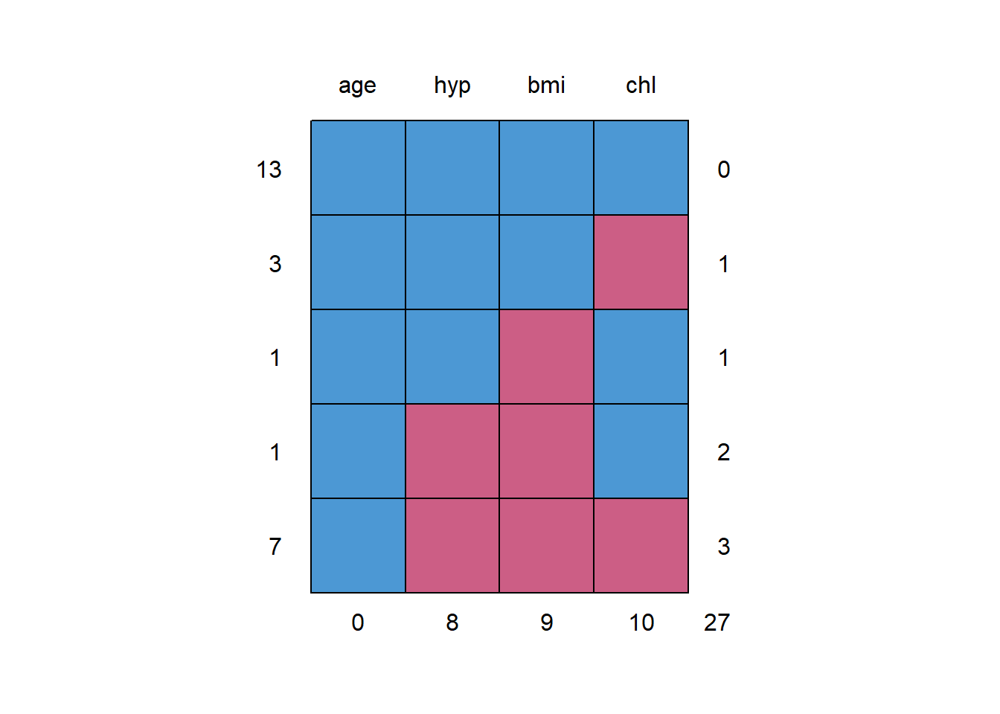
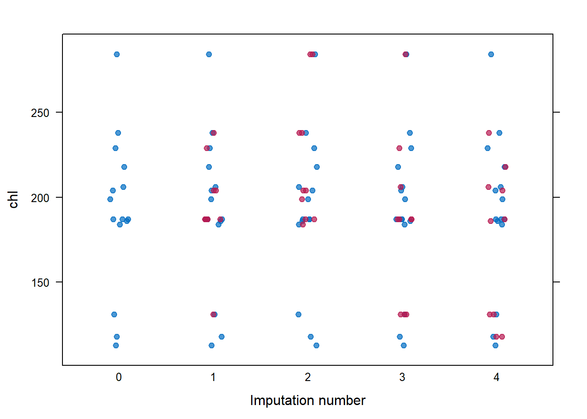

# Multivariate Imputation by Chained Equations (MICE)

## The `mice` package  

[Package Website link](https://amices.org/mice/)

> The mice package implements a method to deal with missing data. The package creates multiple imputations (replacement values) for multivariate missing data. The method is based on **Fully Conditional Specification**, where each incomplete variable is imputed by a separate model. The `mice` algorithm can impute mixes of continuous, binary, unordered categorical and ordered categorical data. In addition, `mice` can impute continuous two-level data, and maintain consistency between imputations by means of passive imputation. Many diagnostic plots are implemented to inspect the quality of the imputations.

[Winnipeg workshop: Handling missing data in `R` with `mice`](https://amices.org/Winnipeg/)


```r
library(tidyverse)
library(mice)
```


```r
?nhanes
```


```r
nhanes
```

```
##    age  bmi hyp chl
## 1    1   NA  NA  NA
## 2    2 22.7   1 187
## 3    1   NA   1 187
## 4    3   NA  NA  NA
## 5    1 20.4   1 113
## 6    3   NA  NA 184
## 7    1 22.5   1 118
## 8    1 30.1   1 187
## 9    2 22.0   1 238
## 10   2   NA  NA  NA
## 11   1   NA  NA  NA
## 12   2   NA  NA  NA
## 13   3 21.7   1 206
## 14   2 28.7   2 204
## 15   1 29.6   1  NA
## 16   1   NA  NA  NA
## 17   3 27.2   2 284
## 18   2 26.3   2 199
## 19   1 35.3   1 218
## 20   3 25.5   2  NA
## 21   1   NA  NA  NA
## 22   1 33.2   1 229
## 23   1 27.5   1 131
## 24   3 24.9   1  NA
## 25   2 27.4   1 186
```


```r
tibble::glimpse(nhanes)
```

```
## Rows: 25
## Columns: 4
## $ age <dbl> 1, 2, 1, 3, 1, 3, 1, 1, 2, 2, 1, 2, 3, 2, 1, 1, 3, 2, 1, 3, 1, ...
## $ bmi <dbl> NA, 22.7, NA, NA, 20.4, NA, 22.5, 30.1, 22.0, NA, NA, NA, 21.7,...
## $ hyp <dbl> NA, 1, 1, NA, 1, NA, 1, 1, 1, NA, NA, NA, 1, 2, 1, NA, 2, 2, 1,...
## $ chl <dbl> NA, 187, 187, NA, 113, 184, 118, 187, 238, NA, NA, NA, 206, 204...
```


```r
summary(nhanes)
```

```
##       age            bmi             hyp             chl       
##  Min.   :1.00   Min.   :20.40   Min.   :1.000   Min.   :113.0  
##  1st Qu.:1.00   1st Qu.:22.65   1st Qu.:1.000   1st Qu.:185.0  
##  Median :2.00   Median :26.75   Median :1.000   Median :187.0  
##  Mean   :1.76   Mean   :26.56   Mean   :1.235   Mean   :191.4  
##  3rd Qu.:2.00   3rd Qu.:28.93   3rd Qu.:1.000   3rd Qu.:212.0  
##  Max.   :3.00   Max.   :35.30   Max.   :2.000   Max.   :284.0  
##                 NA's   :9       NA's   :8       NA's   :10
```


```r
df_nhanes <- nhanes %>% 
  dplyr::mutate(age = factor(age,
                             levels = c(1, 2,3),
                             labels = c("20-39", "40-59", "60+"))) %>% 
  dplyr::mutate(hyp = factor(hyp,
                             levels = c(1, 2),
                             labels = c("no", "yes")))
```


```r
summary(df_nhanes)
```

```
##     age          bmi          hyp          chl       
##  20-39:12   Min.   :20.40   no  :13   Min.   :113.0  
##  40-59: 7   1st Qu.:22.65   yes : 4   1st Qu.:185.0  
##  60+  : 6   Median :26.75   NA's: 8   Median :187.0  
##             Mean   :26.56             Mean   :191.4  
##             3rd Qu.:28.93             3rd Qu.:212.0  
##             Max.   :35.30             Max.   :284.0  
##             NA's   :9                 NA's   :10
```


```r
mice::md.pattern(df_nhanes)
```



```
##    age hyp bmi chl   
## 13   1   1   1   1  0
## 3    1   1   1   0  1
## 1    1   1   0   1  1
## 1    1   0   0   1  2
## 7    1   0   0   0  3
##      0   8   9  10 27
```

## multiple impute the missing values


```r
imp <- mice::mice(data = df_nhanes,   #name of dataset
                  m = 4,              # number of copies
                  seed = 432)
```

```
## 
##  iter imp variable
##   1   1  bmi  hyp  chl
##   1   2  bmi  hyp  chl
##   1   3  bmi  hyp  chl
##   1   4  bmi  hyp  chl
##   2   1  bmi  hyp  chl
##   2   2  bmi  hyp  chl
##   2   3  bmi  hyp  chl
##   2   4  bmi  hyp  chl
##   3   1  bmi  hyp  chl
##   3   2  bmi  hyp  chl
##   3   3  bmi  hyp  chl
##   3   4  bmi  hyp  chl
##   4   1  bmi  hyp  chl
##   4   2  bmi  hyp  chl
##   4   3  bmi  hyp  chl
##   4   4  bmi  hyp  chl
##   5   1  bmi  hyp  chl
##   5   2  bmi  hyp  chl
##   5   3  bmi  hyp  chl
##   5   4  bmi  hyp  chl
```


```r
imp
```

```
## Class: mids
## Number of multiple imputations:  4 
## Imputation methods:
##      age      bmi      hyp      chl 
##       ""    "pmm" "logreg"    "pmm" 
## PredictorMatrix:
##     age bmi hyp chl
## age   0   1   1   1
## bmi   1   0   1   1
## hyp   1   1   0   1
## chl   1   1   1   0
```


```r
mice::stripplot(imp, chl,
                pch = 19,
                xlab = "Imputation number")
```




```r
fit_lm_orig <- lm(chl ~ age + bmi + hyp,
                  data = df_nhanes)
```


```r
summary(fit_lm_orig)
```

```
## 
## Call:
## lm(formula = chl ~ age + bmi + hyp, data = df_nhanes)
## 
## Residuals:
##     Min      1Q  Median      3Q     Max 
## -34.054 -17.670   0.599   7.157  56.611 
## 
## Coefficients:
##             Estimate Std. Error t value Pr(>|t|)   
## (Intercept)  -35.677     63.245  -0.564  0.58815   
## age40-59      59.543     22.947   2.595  0.03187 * 
## age60+       109.458     30.437   3.596  0.00702 **
## bmi            7.160      2.201   3.253  0.01164 * 
## hypyes        -7.692     25.179  -0.305  0.76779   
## ---
## Signif. codes:  0 '***' 0.001 '**' 0.01 '*' 0.05 '.' 0.1 ' ' 1
## 
## Residual standard error: 30.69 on 8 degrees of freedom
##   (12 observations deleted due to missingness)
## Multiple R-squared:  0.736,	Adjusted R-squared:  0.604 
## F-statistic: 5.575 on 4 and 8 DF,  p-value: 0.01916
```

## Run the model on each imputate datset


```r
fit_lm_imp <- with(imp, lm(chl ~ age + bmi + hyp))
```


```r
fit_lm_imp
```

```
## call :
## with.mids(data = imp, expr = lm(chl ~ age + bmi + hyp))
## 
## call1 :
## mice::mice(data = df_nhanes, m = 4, seed = 432)
## 
## nmis :
## age bmi hyp chl 
##   0   9   8  10 
## 
## analyses :
## [[1]]
## 
## Call:
## lm(formula = chl ~ age + bmi + hyp)
## 
## Coefficients:
## (Intercept)     age40-59       age60+          bmi       hypyes  
##     -47.728       49.231       79.355        7.915      -13.321  
## 
## 
## [[2]]
## 
## Call:
## lm(formula = chl ~ age + bmi + hyp)
## 
## Coefficients:
## (Intercept)     age40-59       age60+          bmi       hypyes  
##     -16.836       39.658       94.646        7.111      -10.672  
## 
## 
## [[3]]
## 
## Call:
## lm(formula = chl ~ age + bmi + hyp)
## 
## Coefficients:
## (Intercept)     age40-59       age60+          bmi       hypyes  
##     -46.254       38.224       74.157        7.954      -10.657  
## 
## 
## [[4]]
## 
## Call:
## lm(formula = chl ~ age + bmi + hyp)
## 
## Coefficients:
## (Intercept)     age40-59       age60+          bmi       hypyes  
##     -67.492       63.237       87.428        8.498      -26.126
```

## pool the results into one set of results


```r
fit_lm_pooled <-mice::pool(fit_lm_imp)
```


```r
summary(fit_lm_pooled)
```

```
##          term   estimate std.error  statistic        df      p.value
## 1 (Intercept) -44.577509 56.661924 -0.7867278 13.236591 0.4452990545
## 2    age40-59  47.587598 22.135340  2.1498472  8.263892 0.0627134958
## 3      age60+  83.896675 22.382219  3.7483628 12.144420 0.0027243689
## 4         bmi   7.869366  1.902815  4.1356439 15.162355 0.0008619285
## 5      hypyes -15.193758 18.716802 -0.8117711 12.387123 0.4322460843
```

